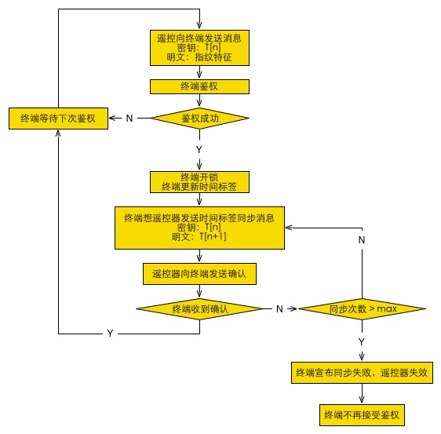

# 系统概述
## 系统结构
系统结构分 终端 和 遥控器 两部分，终端 指车载指纹鉴权和锁闭系统，遥控器 指用户手中的指纹遥控器。
终端由以下部分组成：通信模块、计时模块、加解密模块、指纹鉴权模块、车门锁开闭模块；
遥控器由以下部分组成：通信模块、指纹识别模块、加解密模块。
## 指纹鉴权
使用指纹的特征向量作为鉴权凭证，在遥控器上采集指纹特征向量，加密后发送到终端上，终端解密后将收到的指纹特征向量与本地存储的指纹特征向量进行比对，比对成功后即开锁。
## 基于时间标签的AES加密
时间标签是指一种计时策略，一个时间标签即一个随机数，每次鉴权成功后，时间标签重新生成。鉴于时间标签的时效性，使用时间标签作为加密算法的秘钥，可以有效的避免秘钥被破解。在本系统中，将时间标签作为AES算法的动态密钥，完成加解密。
## 时间标签同步策略
时间标签作为时效性的动态密钥，需要保证通信双方时间标签。这里同步时间标签的方式为主从式，终端 作为主机，遥控器 作为从机，由主机维护时间标签的状态转移和重置，每次鉴权成功后，主机将新的时间标签(T[n+1])用本次的时间标签(T[n])加密后发送给从机，从机更新其时间标签，准备下次鉴权。
## 时间标签同步防抖
为了避免时间标签同步消息发送失败引起同步失效，从机收到主机发送的时间标签同步消息后，须向主机发送确认消息，若主机收到确认，则一次鉴权完成，否则主机再次发送同步消息并等待确认，如此反复，当反复同步次数超过预设的尝试次数时，宣布从机失效。主机向用户发出警告。
## 双端初始化/重置策略
对时间标签进行初始化时，先使用硬件鉴权方式（如物理钥匙）确认环境安全，然后使 终端 和 遥控器 使用有线方式通信，在遥控器上录入指纹并确认后，遥控器 将指纹特征向量发送给终端，终端 重置本地指纹特征向量，并重置本地时间标签，将时间标签以明文方式发送给 遥控器，遥控器 更新自己的时间标签。完成初始化/重置。
## 系统流程
